# Книжки

Н. Вирт. Алгоритмы и структуры данных (2010)
--------------------------------------------

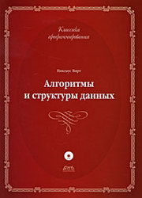

Ну  что тут  можно сказать?  Классика программирования.  То, что  я должен  был
прочесть,  когда учился  -  но  не прочёл.  Базовые  структуры данных,  базовые
алгоритмы, всё  пропитано духом старой  школы, несмотря  на то, что  в название
присутствует фраза "Новая  версия для Оберона". Вспомнил  и понастольгировал по
синтаксису Паскаля. В анализе описываемых  алгоритмов не хватает "забивания" на
малые величины, нет никакого  упоминания асимптотического анализа, "О" большого
и "о" малого.  Сделано это намеренно, чтобы не  забивать голову первокурсникам,
для  которых книга  и предназначена,  или  же связано  с  тем, что  в то  время
асимптотический  анализ применительно  к изучению  сложности алгоритмов  ещё не
применялся  - я  не понял.  В книжке  Кормена это  начинают объяснять  в первую
очередь, поэтому, скорее всего, имеет место быть первый вариант.

В  переводе   позабавило  использования   термина  "древесная   структура"  (от
"древесина", а не от "дерево") для обозначения tree structures.

N. Ford. The Productive Programmer (2008)
-----------------------------------------

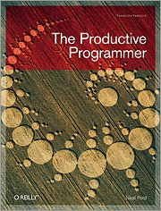

Книжка, ставящая  своей целью сделать  программиста более продуктивным  за счёт
рассказа о  различных утилитах,  хитростях, подходах в  разработке, облегчающим
жизнь  и  упрощающим  работу.  Из  ней  мало  что  нового  для  себя  я  узнал.
Многие  даваемые советы  отталкиваются  от существовавших  на момент  написания
софтин, приведены  скриншоты с элементами  меню, которые нужно  выбрать, чтобы,
собственно, жизнь стала легче, причём с альтернативами для разных платформ. Это
не есть хорошо, потому что чтение становится сиюминутным и актуальным только на
момент написания книги - о большинстве программ  я либо не слышал, либо они уже
являются устаревшими и имеют более  удобные альтернативы. Из этой, практической
части,  я вынес  для  себя  только возможность  поиска  элемента  меню по  мере
написания его названия в OSX по нажатию `Cmd+Shift+?`. Как-то маловато.

Из  теоретической  части   книги,  где  даются  общие   советы  по  разработке,
упоминаются   TDD,  YAGNI,   DSL...  Но   для  себя   я  отметил   лишь  [Закон
Деметры][law-of-demeter] (о  котором уже, впрочем, знал),  позабавила аллегория
[о бритье  яков][do-not-shave-yaks], а  также призыв не  становиться заложником
авторитетов  -  в  том  смысле,  что не  стоит  слепо  следовать  стандартам  и
"практикам", если  их нарушение в  некоторых пунктах сделает жизнь  удобней. Но
последнее должно быть понятно здравомыслящему человеку и без всяких книжек.

В  общем, если  бы эта  книжка попала  ко мне  лет пять  назад, то  принесла бы
гораздо больше пользы, чем сейчас.

A. Aksyonoff. Introduction to Search with Sphinx (2011)
-------------------------------------------------------

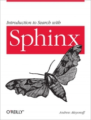

Название говорит само за себя.  Содержимым книга недалеко ушла от документации,
разве  что описывает  некоторые вещи  более подробно.  Некоторые главы  целиком
скопированы из  официального блога (или  же наоборот  - скопированы из  книги в
блог).  Понравилось  описание примера  как  ускорить  обновление индекса  путём
использования  нескольких дельт  индексов.  С другой  стороны,  многих вещей  -
которые пришлось использовать прямо вчера! - в книге нет. Оно и неудивительно -
на  дворе 2014  год, в  то время  как книга  датирована 2011.  Как сам  автор и
призывает, за  актуальной информацией лучше  обратиться к документации.  Но для
того, чтобы поддержать автора столь  хорошего поискового движка, книжку можно и
приобрести.

А. Шилейко. Кибернетика без математики (1977)
---------------------------------------------

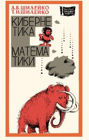

Старая   книжка,  которую   нашёл  в   очередном  списке   прочтённых  книг   у
[darkus'а][darkus-books-issue].   Помимо   введения   в   основы   кибернетики,
классификации  подсистем, из  которых всякая  кибернетическая машина  состоит и
выводов о  том, что  всё в  нашем мире суть  эти самые  кибернетические машины,
было  весьма интересно  прочесть  о состоянии  IT на  заре  её существования  и
предположений  о том,  как, исходя  из  представлений того  времени, она  будет
развиваться. Например, следствием того что цена железки несравнимо дешевле цены
софта  делается вывод,  что  в  будущем "решатели  проблем"  будут выполнены  в
железе, а не в софте.

Кроме этого, рассматривался вопрос искусственного  интеллекта и в частности то,
что является  критерием его  "разумности". Дескать, если  ИИ не  может выиграть
чемпиона по шахматам  и если на основе  этого мы делаем вывод, что  данный ИИ -
неразумен, значит и всякий, кто проиграет этому чемпиону является неразумным, а
это  абсолютное  большинство  человечества.  Т.  о.  ИИ  не  обязательно  нужно
"блестать" в  какой-то сфере,  или даже  во всех  сферах, чтобы  быть разумным.
А  ещё  меня абсолютно  очаровала  идея  создания  автомата со  способностью  к
примитивному обучению  безо всяких  микросхем и софта,  а с  помощью простейшей
[биметаллической пластины][биметаллическая-пластина]!

В общем,  крайне советую  к прочтению эту  коротенькую, действительно  с весьма
малым количеством математики,  книжку. Оно того стоит. Хотя бы  для того, чтобы
понять, что почему кибернетика - это наука о том, куда нужно стучать молотком.

К. Хорстман. Scala для нетерпеливых (2013)
------------------------------------------

С трудом осилил эту  книжку - несмотря на то, что  стремился приступить к тому,
чтобы пощупать  Scala, как можно быстрее.  И дело не столько  в стиле изложения
материала, с  ним вроде всё нормально,  сколько в самой Scala,  в (чрезмерном?)
богатстве  синтаксиса,  в куче  нюансов,  которые,  судя  по всему,  "не  нужно
пытаться понять, нужно просто запомнить". Причём автор книги сам порой отмечает
убогость некоторых конструкций: "синтаксис [опережающего определения] настолько
неуклюж, что только мамочка сможет любить его". Вот, например, так производится
доступ ко второму элементу кортежа: `c._2`. Когда я увидел это, я сразу понял -
что-то  здесь не  так. И  оказался прав:  какая-то монструозная  система типов,
хитрые  неявные  их преобразования  друг  в  друга...  Прав был  tonsky,  когда
[писал][tonsky-post], что "центральная идея Скалы — боль, боль во всем".

В общем,  я возлагал на этот  язык большие надежды, но  он их не оправдал  - на
Scala писать мне будет просто неприятно. На очереди Clojure.

Б. Керниган, Д. Ритчи. Язык программирования Си (2001)
------------------------------------------------------

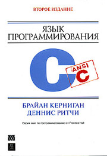

Классика  от  авторов языка,  что  тут  ещё  скажешь, которую  прочесть  раньше
мне,  увы, не  удавалось.  Описание  ядра языка  Си,  довольно-таки простого  и
минималистичного, доступных простых и составных типов данных, нюансы привидения
значений  и адресной  арифметики.  В конце  книжки -  спецификация  ANSI C89  и
описание стандартной  библиотеки. Библиотека,  кстати, хоть и  достаточно мала,
но, на  мой взгляд, чуточку  избыточна (зачем на  каждую функцию есть  аналог с
`stdin`/`stdout`?), а  функции имеют имена, не  отражающие их функциональность.
Например,  чем отличаются  `getc` от  `getchar`?  А тем,  что первой  необходим
формальный параметр в виде указателя на файл, а вторая берет символ из `stdin`!
Весьма  очевидно, ага.  С другой  стороны,  за счёт  малого размера  библиотеки
запомнить труда не составит.

Меня приятно удивило, что уже в ANSI C89 присутствует возможность использования
переменного количества аргументов функции. Думаю, в новых версиях вкусняшек ещё
больше!

В общем,  книжка стоящая, без  шелухи. Лично  мне не хватило  описания процесса
сборки на низком  уровне, а также описания хороших практик  и утилит при работе
над крупными  проектами. Но  оно и  понятно - цель  книги совсем  не в  этом, а
практики и утилиты постоянно меняются.

E. Lehman, T. Leighton. Mathematics for Computer Science (2004)
---------------------------------------------------------------

Я уже [упоминал][puzzle-post]  об этой книжке. Точнее, это не  совсем книжка, а
материал к лекциям  Принстонского университета, в тексте немало  намёков на то,
что непосредственно  происходило на  лекциях, а также  юмор, полный  отсылок ко
внутренней  кухне  университета.  Не  смотря на  это,  основные  математические
концепции, используемые  в computer  science, рассказываются (и  понимаются!) с
лёгкостью, а  примеры, на которых  новые знания закрепляются,  содержат немалое
количество шуток. В  общем, я *чрезвычайно* рекомендую книжку  к прочтению, тем
более что содержит она всего около  трёхсот страниц и доступна для [бесплатного
скачивания][math-for-cs-download]. Но прочесть у меня заняло около двух месяцев
со второго захода. Жуть, конечно, но к качеству содержимого это ни коим образом
не относится.

Как выяснилось,  видеолекции [доступны онлайн][math-for-cs-lectures],  так что,
вероятней всего, стоит совмещать чтение с их просмотром.

A. Avram, F. Marinescu. Domain-Driven Design Quickly (2006)
-----------------------------------------------------------

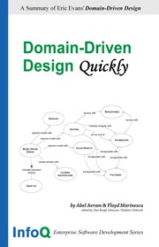

Domain  Driven Design  ([проблемно-оринтированное проектирование][ddd-wiki])  -
набор  правил, позволяющих  принимать правильные  проектные решения  и ускорить
процесс проектирования в незнакомой предметной области. Я захотел познакомиться
с  этим подходом  поближе,  потому  что некоторые  идеи  мне показались  весьма
годными.  Но читать  [автора  подхода][ddd-book] желания  не  было никакого,  и
вместо  этого  я  нашёл  небольшую  брошюрку,  созданную  специально  для  цели
популяризации  DDD  и  доступной  для  [бесплатного  скачивания][ddd-download].
Брошюрка  действительно небольшая,  около  сотни  страниц, и  на  ней с  самого
высокого  уровня, с  высоты птичьего  полёта, рассматриваются  основные идеи  и
паттерны DDD, хорошие  практики при построении информационных  систем в крупных
доменах. Читается легко, все кажется логичным и понятным, но подробностей ждать
не стоит. Впрочем,  вряд ли их можно  обнаружить и в книге автора  подхода - её
поругивают за  большой объем воды и  повторение одного и того  же. Рекомендую к
прочтению, не такая уж она и большая, в конце концов.

M. Fogus. The Joy of Clojure (2011)
----------------------------------

Уже  после  прочтения  книги  я  понял,   что  предпочёл  бы  ей  [Clojure  for
the  brave  and  true][CFTBAT]. Не  то  что  бы  она  плохая, нет  -  но  стиль
повествования  по сравнению  с  альтернативой, которую  я, впрочем,  просмотрел
только  мельком,   скучноват.  Авторы   рассказывают  о  многих   вещах  весьма
поверхностно - поэтому для лучшего усвоения читать её рекомендую с [официальной
документацией][clojure-docs] под рукой.

Сильный упор сделан на то, в чём Кложура блистает - параллельные вычисления, но
это и неудивительно.  Возможно, я в первую  очередь смотрел на неё  как на язык
общего пользования, для  решения повседневных задач, а возможно  потому, что со
всей сложностью параллелизации вычислений ещё  не сталкивался, поэтому глава не
произвела на меня большого эффекта.

В последней  главе, которая  посвящена доказательству утверждения,  что Clojure
"меняет  то, как  вы  думаете", эта  самая мантра  повторяется  в конце  каждой
секции.  Раздражает.  Главным образом  потому,  что  вау-эффекта от  всех  этих
макросов-шмакросов у  меня не возникло -  меня не покидала уверенность,  что то
же  самое,  в принципе,  можно  было  бы  и  простыми функциями  реализовать  в
каком-нибудь другом динамическом языке. Может  быть, не так элегантно, впрочем.

В любом случае, Кложуру, в отличии от Скалы, у меня появилось желание пощупать.
И я  даже начал щупать  - на  [4clojure][]. Пожалуй, стоило  предпочесть книжке
связку 4clojure + официальная документация.

Д. Босуэлл, Т. Фаучер. Читаемый код, или Программирование как искусство (2012)
------------------------------------------------------------------------------

Эту книгу, за авторством разработчиков  из Гугла, мне посоветовали, как выжимку
основных  идей, касаемых  непосредственно кодирования,  из "Совершенного  кода"
Макконнелла, к которой я  приступал дважды, но так и не  осилил. Выжимкой она и
оказалась  -  состоит  практически  из  всего того,  что  я  успел  прочесть  в
"Совершенном коде". Книжка коротенькая,  читается легко, с весёлыми картинками.
Перевод  немного  суховат в  том  плане,  что некоторые  концепции  переводятся
дословно  вместо  общепринятых аббревиатур  -  "DRY"  как "не  повторяй  себя",
"разработка,  ориентированная  на  тестирование"  вместо "TDD"  и  т.  п.  Судя
по  всему, книжка  ориентирована  на свежеиспечённых  программистов,  ещё и  не
слышавших об упомянутых  терминах - лично я  узнал из неё мало нового  и, как и
вторую книжку из этого списка, предпочёл бы увидеть её в начале карьеры.

[law-of-demeter]: http://ru.wikipedia.org/wiki/Закон_Деметры
[do-not-shave-yaks]: #TBD
[биметаллическая-пластина]: https://ru.wikipedia.org/wiki/Биметаллическая_пластина
[tonsky-post]: http://tonsky.livejournal.com/294276.html
[puzzle-post]: #TBD
[math-for-cs-download]: http://www.cs.princeton.edu/courses/archive/spr10/cos433/mathcs.pdf
[math-for-cs-lectures]: http://ocw.mit.edu/courses/electrical-engineering-and-computer-science/6-042j-mathematics-for-computer-science-fall-2010/index.htm
[ddd-wiki]: https://ru.wikipedia.org/wiki/Проблемно-ориентированное_проектирование
[ddd-download]: http://www.infoq.com/minibooks/domain-driven-design-quickly
[ddd-book]: http://www.amazon.com/Domain-Driven-Design-Tackling-Complexity-Software/dp/0321125215
[CFTBAT]: http://www.braveclojure.com/
[clojure-docs]: http://clojure.org/documentation
[4clojure]: http://www.4clojure.com/

Х. Абельсон. Структура и интерпретация компьютерных программ (2006)
-------------------------------------------------------------------

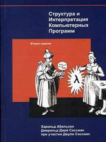

Еще одна классика computer science, которую прочесть удалось мне, увы, позже чем
стоило. Эх, вот бы  наткнуться на нее лет пять назад!  Не то  что бы узнал много
нового, но читать  книгу просто интересно, интересно наблюдать  о рассуждении за
тем,  как усложняются  вычислительные модели  и, как  следствие, рассматриваемый
язык, по  мере того, как приходится  решать все новые и  новые задачи. Поначалу,
вдохновившись, я хотел было составить  ее краткий конспект и процитировать самые
интересные места (особенно  мне понравилось заявление, что в  языке с поддержкой
оптимизации  хвостовой   рекурсии  операторы   циклов  являются  не   более  чем
синтаксическим сахаром и особой нужды в них нет), но, на мой взгляд, книга столь
хороша, что замечательный  источник для цитаты можно найти  практически в каждом
абзаце. Подтверждением этого является наличие твиттер-аккаунта [@SICPQuotes][].

Я читал  классическую версию  SICP, то  есть с Лиспом,  а не  адаптированную под
какой-то другой  язык, коих развелось  сейчас видимо-невидимо. Где-то  я слышал,
что, чтобы  проникнуться Лиспом, SICP  подходит как нельзя  лучше, но я  не могу
сказать, что на меня как-то это повлияло.

В общем, книгу крайне рекомендую.

R. Ierusalimschy. Programming in Lua (2006)
-------------------------------------------

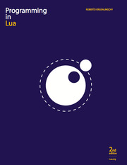

"Официальная" книга по Lua от автора языка - в предисловии написали, что приняли
решение издавать  книгу самостоятельно с  целью сохранить  права за собой,  а не
передавать его издательству.

Книга  рассматривает нюансы  Lua  и её  взаимодействия  с С-кодом.  Неоднократно
подчеркивается, что один из принципов языка  - маленькое ядро и совместимость со
стандартным  C-компилятором  -  чтобы  была  возможность  иметь  язык  на  любой
платформе, для которой есть компилятор C. Как следствие, в языке мало чего есть,
например,  отсутствуют   даже  такая   популярная  вещь,   как  PCRE-совместимые
регулярки,  вместо  этого  есть  свое  поделие -  все  с  целью  сохранить  ядро
миниатюрным.  Если с  подходом использования  одной структуры  данных еще  можно
смириться,   то  синтаксис   вызывает  вопросы:   с  одной   стороны,  он,   что
ли...  скуден?..  а  с  другой  - весьма  непривычен,  кажется  порой  странным.
Наверное, связано это с тем, что язык  все-таки не молод и не перенял синтаксиса
языков,  ставших  популярными  позднее.  В   качестве  примеров  -  проверка  на
неравенство  выглядит как  `~=`  вместо привычного  `!=`,  а конкатенация  строк
осуществляется  с   использованием  `..`.  Почему   не  `+`?  У   меня  возникло
предположение,  что это  связано с  тем,  что язык  разработан и  поддерживается
командой Папского  католического университета Рио-де-Жанейро, а  потому крестами
решили не разбрасываться.

Издание, которое  читал я  - не  самое последнее, и,  хотя сменилась  всего одна
минорная   версия   языка,   какие-то  изменения,   которые   с   воодушевлением
представлялись в книге,  уже стали deprecated. Это наводит на  нехорошие мысли о
дизайнерах языка.

Учитывая маленькое  ядро языка и  простейший синтаксис, я бы  порекомендовал эту
книжку только  за неимением почитать  ничего интересней.  Все, что может  от Lua
понадобиться, проще найти в поисковике при необходимости.

Р. Докинз. Эгоистичный ген (2013)
---------------------------------

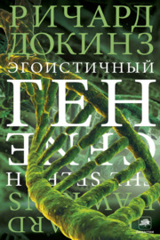

Уж и не помню, кто надоумил почитать эту книгу, но после ее прочтения я сразу же
приобрел в бумажном варианте все  остальные бестселлеры автора. Докинз интересно
и  увлекательно пишет,  из книги  я  узнал для  себя новые  нюансы работы  таких
сложных машин, как живые организмы, а концепция эгоистичного гена, пронизывающая
абсолютно  все уровни  существования  живых  организмов, на,  теперь  уже и  мой
взгляд,  как  нельзя лучше  отражает  реальность  -  Докинз приводит  доводы,  с
которыми  сложно  поспорить,  а  точки  зрения  оппонентов  опровергает  умно  и
интересно. Я *крайне*  рекомендую книгу [автора теории  мемов][мемы], или мимов,
как было переведено в  том издании, что я читал, а сам  с нетерпением жду, когда
приступлю к следующей его книге.

Р. Фейнман. Фейнмановские лекции по физике. Законы механики (1965)
------------------------------------------------------------------

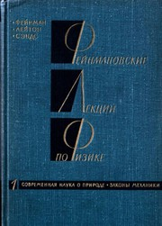

Прочтение "Эгоистичного гена"  вновь подстегнуло мой интерес к наукам  и я решил
повременить со чтением  чисто айтишных произведений. С  Фейнманом я познакомился
при прочтении его автобиографической "Вы, конечно, шутите, мистер Фейнман", и он
меня абсолютно очаровал - наверное, если бы мне задали вопрос, кто из ученых мне
симпатичен более всех, я бы не раздумывая назвал его имя.

О Фейнмановских лекциях я уже был в курсе, и даже (безуспешно) пытался их начать
читать с  целью заполнить бывшие -  либо образовавшиеся за неимением  практики -
белые пятна  в знаниях.  Недавно  же наткнулся  (не спрашивайте, как)  на список
"Самообразование by 2ch", где по физике  предлагалось читать именно эти книги. И
я начал читать.  Это издание, еще советское, разбивает три  оригинальных тома на
шесть, благодаря чему проглатывать из становится гораздо проще.

Фейнман  пишет с  присущей  ему  веселостью, забавными  сравнениями  и при  этом
описывает  то, что  происходит  на атомном  уровне  так просто  и  вместе с  тем
увлекательно, что пониманием процессов буквально становится интуитивным - теперь
если  я  думаю о  механизмах,  отвечающих  за  теплоту, например,  я  немедленно
представляю себе  те картинки,  которые были описаны  автором. Преподавательский
талант его  весьма велик - объяснение  таких вещей, как производная  (и операция
дифференцирования)  и интеграл  (и операция  интегрирования) даны  так просто  и
вместе  с   тем  понятно,  как  я   не  видел  еще   ни  в  одной  из   книг  по
математике.  Физический  смысл важен  -  потому  как  мозг наш  ориентирован  на
оперирование образами,  которые вокруг абстрактных  цифр и графиков  не очень-то
построишь. Рекомендую.

Б. Рассел. История западной философии (2001)
--------------------------------------------

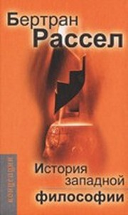

С Расселом я был заочно  знаком благодаря знаменитому [чайнику Рассела][чайник].
Когда  же я  увидел  что  в качестве  вводного  курса  философии его  предлагают
прочесть  в том  самом "Самообразование  by 2ch"  списке (к  которому я  отнесся
сперва скептически - но увидев там Фейнмана и Рассела скепсис начал ослабевать),
я решил  его прочесть, потому  как...  да, вновь  хотел заполнить белые  пятна в
знаниях. Удалось  ли мне это  - вопрос спорный, вроде  бы и есть  обзор основных
философских идей со времен древней Греции вплоть до середины 20го века и то, как
они  влияли  на  социальные  и  политические  события...   но  большинство  этих
метафизических теорий  прошли мимо,  в мозгу же  осели самые  запоминающиеся или
необычные (например, доказательство существования Бога за авторством Беркли, или
теория идей Платона,  или того, что реальность вечна и  неизменяема Парменида) -
возможно, потому,  что никаких  объективных доказательств правоты  своих теорий,
помимо онтологических, нет.

Возможно,   это   и   правильно,    зачем   всей   метафизикой   подряд   голову
забивать.  Гораздо   интересней  мне  было  читать   про  исторические  события,
предшествующие появлению той или иной философской  концепции - то есть книга при
этом  является нескучным  учебником  истории и  вполне  себе достойно  описывает
преемственность различных цивилизаций. Замечательно то,  что Рассел, так как сам
являлся признанным философом, не просто  скучно описывал те или иные философские
идеи,  а  вполне  успешно  "пробовал  их на  зуб"  и  критиковал,  показывал  их
ложность.  Доставило,  как  был  раскритикован  Ницше,  за  то,  что  слова  его
расходились с делами: в частности, его  призыв брать с собой плетку, когда идешь
к женщине. Мол, сам-то Ницше с женщинами  помимо сестры и не общался, и не ходил
к ним вовсе,  не говоря уж о том,  чтобы брать с собой плетку,  потому что знал,
что от девяти из десяти женщин этой самой плеткой бы и получил.

Фраза,  очередной  раз говорящая  в  пользу  того,  что история  развивается  по
спирали, написанная в 1945ом году, но актуальная и сейчас:

> То,  что случилось  в великую  эпоху Греции,  произошло снова  в Италии  эпохи
> Возрождения:  традиционные моральные  ограничения  исчезли, потому  что у  них
> увидели  связь  с  предрассудком;  освобождение от  пут  возбудило  энергию  и
> творчество,  привело к  редкому рассвету  гения, но  анархия и  предательство,
> неизбежно  следующие за  упадком морали,  обессилили итальянцев  как нацию,  и
> итальянцы попали, подобно грекам,  под господство наций, менее цивилизованных,
> чем они сами, но не в такой мере лишенных общественной связи.

Вызывает сомнение  что философские доктрины  - не политическая философия,  а вот
"классическая",   метафизическая  -   действительно  влияют   на  социальные   и
политические процессы *настолько сильно*, как на том настаивает Рассел.  Широким
массам  философией  не  интересна,   а  правящая  аристократия  может,  конечно,
увлекаться  теми  или  иными  идеями,  но  чтобы  это  оказывало  такое  большое
влияние...  как-то  сомнительно.  Конечно,  элита  может  говорить  о  том,  что
руководствуется высокими философскими  идеалами - но на мой взгляд  это не более
чем болтовня вполне в духе Макиавелли. Чтобы Гегель оказывал влияние на политику
Советского   Союза,   а   Руссо   и   прочие   романтики   -   на   гитлеровскую
Германию... верится слабо.

Тем не менее, как обзор развития философских идей и государств Западной Европу я
эту книгу крайне рекомендую.

Р. Докинз. Слепой часовщик (2014)
---------------------------------

Подзаголовок книги, "Как эволюция доказывает отсутствие замысла во Вселенной", в
принципе, объясняет, о  чем эта книга для  тех кто не понял, на  что намекает её
название.   Под  "замыслом"   здесь   понимается  не   столько  конечный   смысл
существования Вселенной (хотя, уверен,  Докинз, как ярый противник креоционизма,
имел ввиду  и это), сколько  изначальный замысел,  то есть создание  Вселенной и
всех ее  составляющих - главным образом,  разумеется, живых существ. От  главы к
главе,  на примере  виртуальных существ,  живущих в  его компьютере,  на примере
генетического  программирования,  оперируя   комбинаторикой  и  терминами  вроде
"гиперпространства жизни"  Докинз, с  одной стороны,  развенчивает мифы  о самой
теории эволюции, а с другой - мифы о том, что некоторые научные теории пошатнули
или вовсе  ее отменили.  Также проходится  по теориям, которые  и в  принципе не
могут  с теорией  эволюции  соперничать,  как бы  не  хотели  её противники  или
апологеты других точек зрения.

Книга хороша, но, по сравнению с "Эгоистичным геном", показалась мне слабоватой,
ничего   прямо  ошеломляюще   нового  я   из  нее,   помимо  забавного   термина
["раскладион", или единицы невероятности][раскладион], не почерпнул.

Для людей, которым  не все основные положения теории эволюции  ясны - и основной
из  них, гласящий,  что  эволюция -  это не  просто  одношаговая случайность,  а
совокупность  маленьких случайных  шагов,  каждый неверный  из которых  карается
естественным  отбором -  книга однозначно  must read.  Для всех  остальных -  по
желанию.

Ю. Никитин. Alouette, little Alouette… (2014)
---------------------------------------------

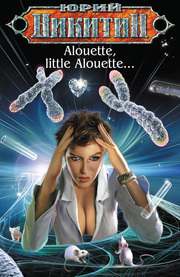

Без преувеличения  скажу, что  творчество Юрия  Никитина оказало  на меня  и мое
мировоззрение чрезвычайное огромное влияние,  я порой задумываюсь что, возможно,
и чрезмерное. Это заметила и моя жена, которая взялась за "Трансчеловека". Я уже
продолжительное  время   не  читал   художественной  литературы   (последние  из
прочитанных,  опять же,  были книги  Никитина  - "Сингомейкеры",  после чего  я,
кажется,  понял, чего  хочет  от  меня автор  и  постарался  сократить время  на
развлечения,  в  том  числе  и  художественную  литературу),  но  недавно  решил
посмотреть,  что новенького  у  него появилось.  Внимание  привлекла эта  книга,
главным образом аннотацией:

> Возможно, любовь тоже исчезнет в наступающем  суровом мире, где можно будет не
> только  обрести долголетие,  завидное здоровье,  быстроту реакции  и увеличить
> объем памяти, но и убрать из нашей сути все, что причиняет страдания?  Это уже
> не теория, Максим и Аллуэтта столкнулись с  этой проблемой лицом к лицу.  И им
> предстоит трудный выбор… и не совсем ожидаемое решение.

И,  хотя  Никитин   постоянно  убеждал  всех  читать  книги,   а  не  аннотации,
по-хулигански  описывая в  них то,  чего непосредственно  в книге  и не  увидишь
("Артания", старое  издание), это  спускалось с рук,  поскольку в  результате от
книги всегда получал гораздо больше. Здесь же... все случилось наоборот.

Меня действительно интересовал вопрос - а действительно, что случится с любовью,
со всеми  чувствами, когда технический  прогресс подойдет настолько  близко, что
позволит их  отключать? И примерный  ответ хотелось  бы получить не  столько для
себя, сколько  для близких  мне людей.  И вроде бы  ответ не  сложен, ибо  и без
всякого прогресса можно  наблюдать в повседневности, что  чувства имеют свойства
угасать, если их не поддерживать, но от книги я ожидал, что "решение", о котором
говорят, будет действительно ошеломляющим, заставляющим задуматься: что-то вроде
слияния сознаний, существование в виде  объединенной сущности...  как это будет,
куда денутся чувства, станут ли сильнее?

Что  же  я  получил  в  итоге? Короткую  книженцию  практически  без  сюжета,  с
картонными героями,  каждый из которых  высказывает идеи самого автора  - просто
высказывает, нет  даже диалога,  альтернативных точек  зрения, ибо  все согласно
кивают *головой*.  Главный герой, как всегда  в книгах Никитина -  копия автора,
пьет  кофе   литрами,  умный   и  красивый,   девки  так   и  вешаются,   но  он
невозмутим.  Идеи, высказываемые  персонажами,  не  новы, их  я  читал в  книгах
Никитина  и  раньше,  а  зачастую противоречивы  и  непоследовательны.  С  одной
стороны, говорят  во всю про сингулярность  и презрение ко всему  животному, а с
другой "мужчина должен,  женщина должна..." - и ничего, если  бы при этом герой,
хотя бы про себя, говорил, что это всего лишь уступка современности, а в будущем
он так нелепо поступать не будет - нет, такого конфликта нет, герой в самом деле
считает, что  здесь нет проблемы и  противоречия.  Концовка смазана, давно  я не
видел такой deus ex machina, которая, как мне показалось, была желанием поскорее
поставить в повествовании точку, поскольку  иначе это сделать не получалось: нет
ведь сюжета-то толком!

Не удовлетворен,  не советую.  Хотелось бы чего-то  поглыбже и  поумнее. Читайте
лучше  "Трансчеловека", эта  книга, на  мой взгляд,  оказала на  меня наибольшее
влияние. "Сингомейкеры"  после "Трансчеловека" хороши как  ужастик, но качеством
ниже.

Р. Докинз. Бог как иллюзия (2013)
---------------------------------

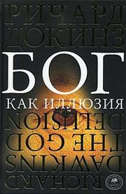

Замечательная книга, в которой автор  последовательно проходится по всем доводам
в пользу креационистких теорий, а  также теориям, противоречащим теории эволюции
Дарвина и разносит их в пух и прах.

Помимо  рассмотрения   непосредственно  теорий  зарождения  и   развития  жизни,
рассматривается и морально-этические стороны вопроса: например, утверждения, что
без веры в Бога  не было бы и нужды следовать каким-то принципам  и мир давно бы
скатился  в хаос  (хотя следовать  принципам только  из-за боязни  наказания еще
страшнее).  Вера  в Бога, кроме прочего,  рассматривается как гипертрофированный
механизм "невидимого друга", который встречается  у детей.  Развенчивается миф о
том, что среди  ученых много верующих людей  так, как принято в  научной среде -
ссылкой  на  фактические   данные  множества  опросов.  Другие   доводы  так  же
подкреплены ссылками.

Докинз  занимает жестокую  негативную позицию  касательно разделения  сфер между
наукой и религией: мол, религия изучает  духовные вопросы, в которые науке лучше
не лезть, а в  ответ религия не будет лезть в науку. В  общем, он вновь выступил
как "цепной пес Дарвина", показав себя непримиримым борцом с мракобесием в любых
его проявлениях.

Книга стоящая, чтобы ее прочесть, написано  здраво и интересно, а размещенными в
конце ее ссылками можно пользоваться  в спорах с верунами (вопрос плодотворности
этого оставим в стороне).

G. Polya. How to Solve It (1945)
--------------------------------

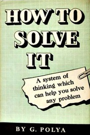

Не помню, как именно наткнулся на эту книгу - кажется, услышал в одной из лекций
то ли Ричча Хикки, то ли Алана  Кея - где советовалось прочесть ее, дабы понять,
как решать  проблемы *правильно*.  Книга очень короткая  и, в  принципе, хорошая
выжимка     основных    идей     есть    на     [соответствующей    статье     в
Википедии][how-to-solve-it-wiki].  В принципе,  основные четыре  шага есть  суть
научного метода.  Несмотря на  то, что книга короткая, в ней,  как я думаю, есть
почти  все, что  пропагандируется  апологетами  [ТРИЗ][пост-о-ТРИЗ], за  минусом
пафоса, аббревиатур и платных книжек.

Автор  ориентируется  и  воспринимает  читателя  как  преподавателя  математики,
который хочет  не просто  дать ученикам  знания, но и  научить их  думать. Книга
потому  разделена  на  две  части: в  первой  описывается  процесс  "постановки"
мышления  ученика, когда  учитель пытается  путем наводящих  вопросов натолкнуть
ученика на идеи  о том, как решить  задачу; вторая, большая часть,  - это своего
рода "словарик  эвристик", то  есть методов решения  проблем, а  также связанных
терминов.

Эта книжка, разумеется,  будет полезна не только и не  столько учителям, сколько
всем кто желает улучить скилл решения проблем  и поставить его себе на службу, а
не  дожидаться  неведомых, неконтролируемых  "озарений".   Несмотря  на то,  что
написана давно, актуальность  она не утратила - просто  потому, что используемые
методы изобретены давно, и ничего существенного нового человечество за это время
не придумало.  Здесь же  информация систематизирована и  подана в  удобном виде.
Советую, хотя бы потому что короткая. Да и сам перечитаю, ведь повторение - мать
учения.

J. Armstrong. Making reliable distributed systems in the presence of software errors (2003)
-------------------------------------------------------------------------------------------

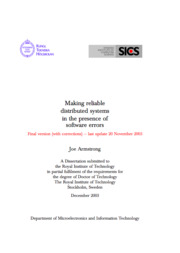

Эта [открыто доступная][armstrong-thesis] книжка - не книжка даже, а диссертация
на  соискание  докторской   степени  за  авторством  автора   языка  Erlang  Джо
Армстронга.  Наткнулся  на  нее  когда   смотрел  видео  [The  Language  of  the
System][the-language-of-the-system] Рича Хикки, который крайне советую.

Суть  в  том,  что  автор  выдвигает   свое  видение  того,  как  нужно  строить
распределенные системы с  учетом наличия ошибок (которые,  как мудро замечается,
будут  присутствовать  в распределенных  системах  всегда,  и пытаться  победить
которые  вместо  того  чтобы  научиться  с ними  жить  -  глупо).  Приводятся  и
обосновываются   основные   компоненты   подобных    систем   и   их   свойства,
характеристики, при чем учитываются не только чисто технические преимущества, но
и организационные: как, например,  построенные системы ложатся на распределенные
и крупные отделы разработки, почему их поддержка дешевле и т. п.

В итоге делается  попытка реализовать платформу, основанную на  этих принципах -
Erlang.  Вводится краткий, но, как я  понимаю, достаточный инструктаж по языку и
фреймворку OTP, а также планы по дальнейшему их развитию.

Диссертация,   несмотря  на   ее  кратость,   произвела  на   меня  неизгладимое
впечатление, я теперь совсем иначе смотрю на то, как нужно строить системы. Хотя
в качестве ответа  и предлагается Erlang, все же основные  идеи можно попытаться
реализовать и самостоятельно,  на том, что имеется. Я  *крайне* советую прочесть
этот труд. Кроме прочего, хоть он и  не совсем о языке программирования - но меж
тем это  лучшее введение в ЯП  которое я когда-либо читал:  здесь объясняется не
просто что  язык из  себя представляет,  но и  то, *зачем*  он нужен  и *почему*
сделан именно таким. Masterpiece.

[@SICPQuotes]: https://twitter.com/sicpquotes
[мемы]: https://ru.wikipedia.org/wiki/Мем
[чайник]: https://ru.wikipedia.org/wiki/Чайник_Рассела
[раскладион]: https://twitter.com/neoascetic/status/743813224445915136
[how-to-solve-it-wiki]: https://en.wikipedia.org/wiki/How_to_Solve_It
[пост-о-ТРИЗ]: ../triz-course/
[armstrong-thesis]: http://erlang.org/download/armstrong_thesis_2003.pdf
[the-language-of-the-system]: https://www.youtube.com/watch?v=ROor6_NGIWU
